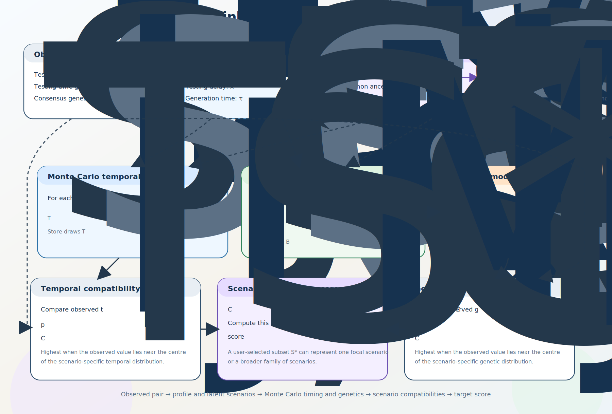

# EpiLink

EpiLink is a Python package for epidemiological linkage inference from paired temporal and genetic observations. It scores recent latent transmission scenarios using the variable-infectiousness E/P/I model of Hart, Maini, and Thompson (2021) and returns compatibility values for individual scenarios or user-defined target subsets.

## Highlights

- Scores observed pairs using testing-time difference and consensus-level genetic distance.
- Supports both deterministic and stochastic mutation models.
- Works with single observations or vectorized grids through cached pairwise scorers.
- Includes a usage notebook in [docs/epilink_usage_notebook.ipynb](docs/epilink_usage_notebook.ipynb).

## Installation

Install from source with:

```bash
python -m pip install -e .
```

For development tools as well:

```bash
python -m pip install -e ".[dev]"
```

EpiLink requires Python 3.10 or newer and depends on `numpy` and `scipy`.

## Core concepts

EpiLink enumerates latent scenarios such as:

- `ad(0)`: direct ancestor-descendant transmission with no hidden intermediate.
- `ad(1)`: ancestor-descendant transmission with one hidden intermediate.
- `ca(0,0)`: a shared recent common ancestor with one branch to each sampled case.
- `ca(m_i,m_j)`: a common-ancestor scenario with `m_i` and `m_j` hidden generations on each branch.

You can score a single scenario or sum compatibility across a subset of scenarios by passing a list to `target`.

The underlying temporal model follows:

- Hart WS, Maini PK, Thompson RN. High infectiousness immediately before COVID-19 symptom onset highlights the importance of continued contact tracing. *eLife*. 2021;10:e65534. <http://dx.doi.org/10.7554/eLife.65534>

## Workflow schematic

The schematic below summarizes how EpiLink turns one observed pair into scenario-level and target-level compatibility scores.

- Start with the observed testing-time difference and consensus genetic distance for a pair of samples.
- Combine these observations with the E/P/I temporal model and a set of latent transmission scenarios.
- Use Monte Carlo draws to generate scenario-specific temporal and branch-length distributions, then map branch lengths to expected or stochastic mutation counts.
- Convert both the temporal and genetic observations into compatibility scores and combine them into a final scenario score or a user-defined target-subset score.



*Figure: EpiLink compatibility workflow. Observed pairwise data are compared with Monte Carlo timing and genetic draws under candidate latent transmission scenarios. Temporal and genetic compatibilities are combined into scenario scores, which can then be summed over a user-selected target subset.*

## Quick start

```python
from epilink import EpiLink, InfectiousnessToTransmission, NaturalHistoryParameters

parameters = NaturalHistoryParameters()
profile = InfectiousnessToTransmission(parameters=parameters, rng_seed=2026)

model = EpiLink(
    transmission_profile=profile,
    maximum_depth=10,
    mc_samples=20000,
    target=["ad(0)", "ca(0,0)"],
    mutation_process="stochastic",
)

result = model.score_pair(
    sample_time_difference=3.0,
    genetic_distance=2.0,
)

print(result["target_labels"])
print(result["target_compatibility"])
```

For vectorized scoring over a grid:

```python
import numpy as np

pairwise = model.pairwise_model(target=["ad(0)", "ca(0,0)"])
time_grid = np.linspace(-10, 10, 101)
genetic_grid = np.arange(0, 8)
compatibility = pairwise(time_grid[None, :], genetic_grid[:, None])
```

## Performance

EpiLink is designed to support fast vectorized compatibility scoring. In local benchmarking on a single core of a MacBook M1:

```text
Compatibility calculation for 100,000,000 pairs
CPU times: user 1.06 s, sys: 2.58 s, total: 3.65 s
Wall time: 5.17 s
```

## Mutation models

- `mutation_process="deterministic"` compares observations with expected mutation counts.
- `mutation_process="stochastic"` compares observations with Poisson mutation-count draws.

The stochastic option is useful when you want mutation-count variability to be part of the compatibility calculation.

## Documentation

- Usage notebook: [docs/epilink_usage_notebook.ipynb](docs/epilink_usage_notebook.ipynb)
- Derivation manuscript: [docs/assets/epilink.pdf](docs/assets/epilink.pdf)
- Summary figure script: [docs/epilink_summary_figure.py](docs/epilink_summary_figure.py)

## Development

Run the main checks with:

```bash
ruff check .
pytest
```

If you use the conda environment in this repository, activate it first:

```bash
conda activate epilink
```

See [CONTRIBUTING.md](CONTRIBUTING.md) for a short development guide.

## Citation

If you use EpiLink in research, please cite both the software metadata in [CITATION.cff](CITATION.cff) and the underlying E/P/I infectiousness model reference above when it is methodologically relevant.

## License

This project is distributed under the MIT License. See [LICENSE](LICENSE).
