# Synthetic EpiLink exploration

## Run and scope

This run evaluates 12,447,555 unordered pairs among 4,990 sampled cases. There are 1 transmission components. The immediate target prevalence is 0.1447%. The analysis is exploratory and conditional on this transmission tree. EDD/EDS use deterministic inference with deterministic/stochastic observed genetics; ESD/ESS use stochastic inference with deterministic/stochastic observed genetics. Raw compatibility scores are not transmission probabilities. Historical reproduction status: all_labels_and_selected_epilink_scores_reproduced.

## 1. Observable ambiguity and EpiLink relationships

CaseID1 and CaseID2 identify the unordered pair in stable tree input order. AD and CA are binary. For AD, m is the number of intermediate cases; for CA, m1 and m2 are the intermediates from the shared ancestor to CaseID1 and CaseID2. Inactive counts are null. Direct transmission is AD(0), and a shared infector is CA(0,0). An AD ancestor may be either case. M combines the active class: M=m for AD and M=m1+m2 for CA. It counts total intermediates and excludes the shared ancestor for CA. Both immediate targets have M=0. The transmission-edge distance is M+1 for AD and M+2 for CA; those edge counts remain available as tree_hops. AD, CA, m, m1, and m2 remain available because equal M need not imply the same branch geometry. CA(a,b) and CA(b,a) are the same relationship: count summaries combine them using m1<=m2. The pair table retains branch depths aligned with the two case IDs. M is null for pairs from separate trees. The shared tree table records every pair once, independently of simulation seed and sampling. Mixed feature cells contain both target and other relationships with exactly the same observed inputs. Their members cannot all be separated by a deterministic rule using only these inputs. The heatmaps show a limited viewing window; the tables contain the full range. Empirical overlap is conditional on this realization, not a population identifiability theorem.

| data_process | n_cells | mixed_cells | target_fraction_in_mixed_cells | target_non_target_distribution_overlap |
| --- | --- | --- | --- | --- |
| deterministic | 5536 | 127 | 1 | 0.0142 |
| stochastic | 6358 | 209 | 1 | 0.05127 |

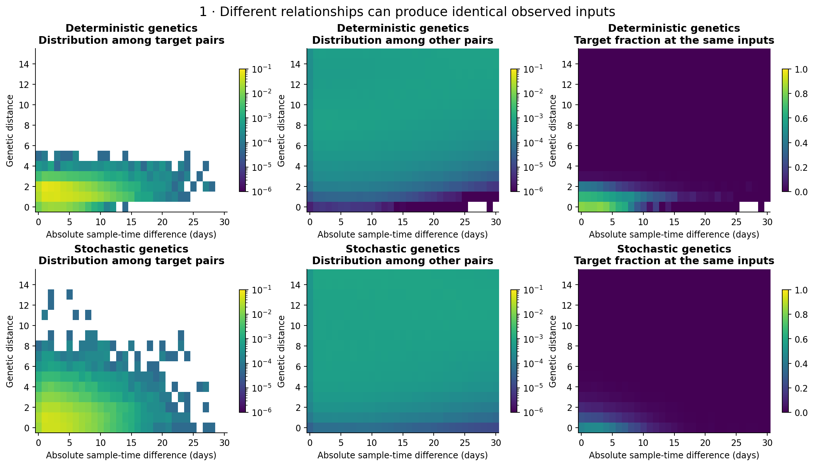

## 2. Information in high scores

Selections include every pair tied at the cutoff; actual selected fractions can exceed the requested budget. At the operating points below, target recall is at least 70%. Enrichment divides target precision by its prevalence among all sampled pairs. The broad relationship display is supplemented by exact AD/CA/m/m1/m2/M counts in selection_epilink_encodings.csv, score distributions in score_by_M.csv, and selected counts in selection_M.csv. The M-versus-score heatmaps show P(M | score band): each occupied column sums to one, weighted by the number of pairs. Zero scores have a separate column; positive-score bands have width 0.05 unless configured otherwise. Colour uses a common logarithmic fraction scale, with zero-probability cells white and empty score bands grey. Lines give the median and 10th/90th percentiles of M, not uncertainty intervals. Separate AD and CA views retain the same scales. Distance summaries include connected pairs only; separate-introduction fractions are reported explicitly. A high enrichment and a modest target precision can both be true. Other AD or CA pairs are not silently relabelled as true target pairs.

| model | selected_pairs | precision | recall | target_enrichment | median_M_connected | p90_M_connected |
| --- | --- | --- | --- | --- | --- | --- |
| EDD | 44533 | 0.2939 | 0.7267 | 203.1 | 1 | 3 |
| EDS | 122641 | 0.1044 | 0.711 | 72.16 | 4 | 8 |
| ESD | 27262 | 0.4637 | 0.7019 | 320.5 | 1 | 3 |
| ESS | 76260 | 0.1668 | 0.7064 | 115.3 | 3 | 8 |

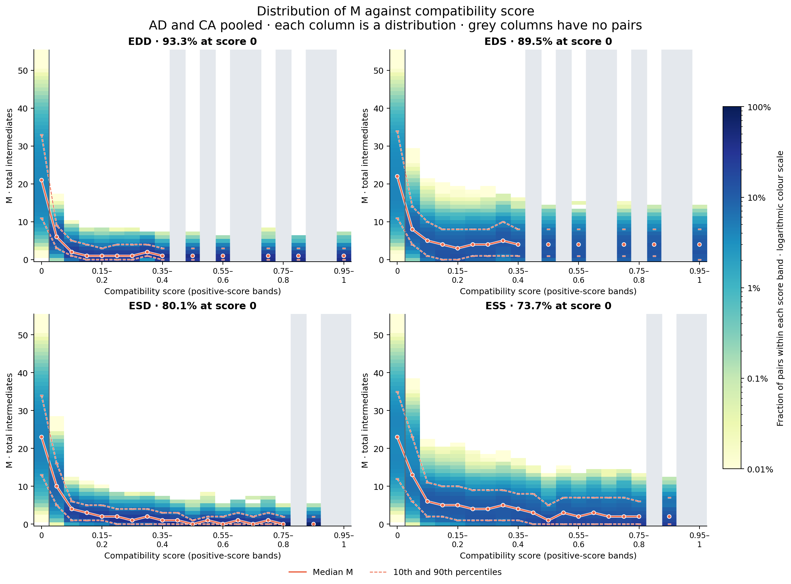

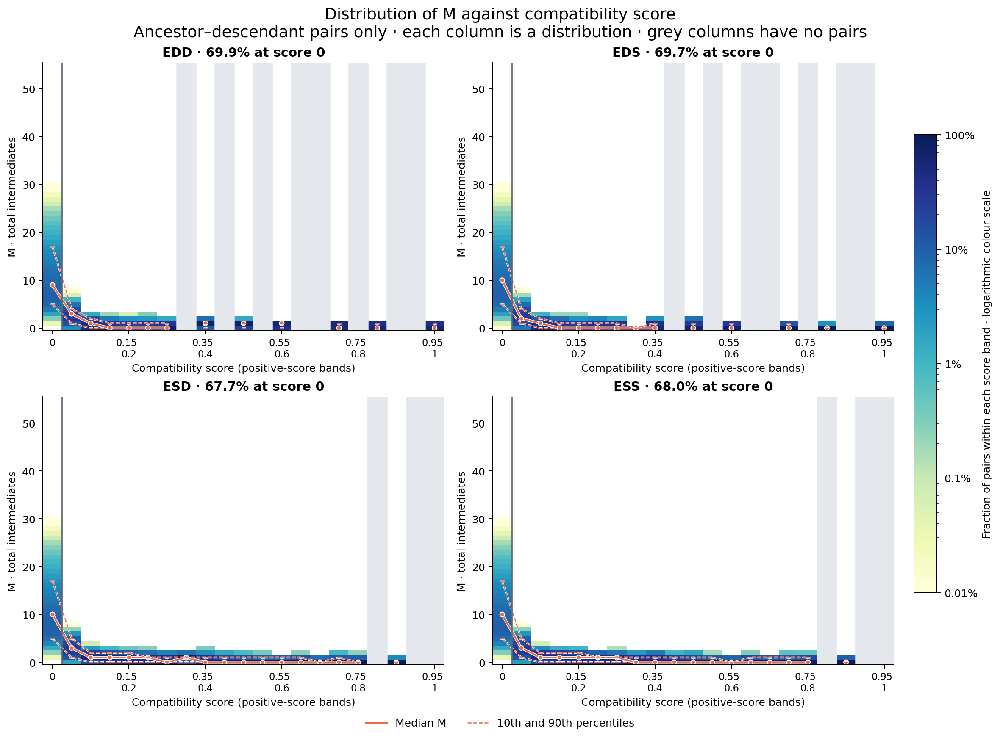

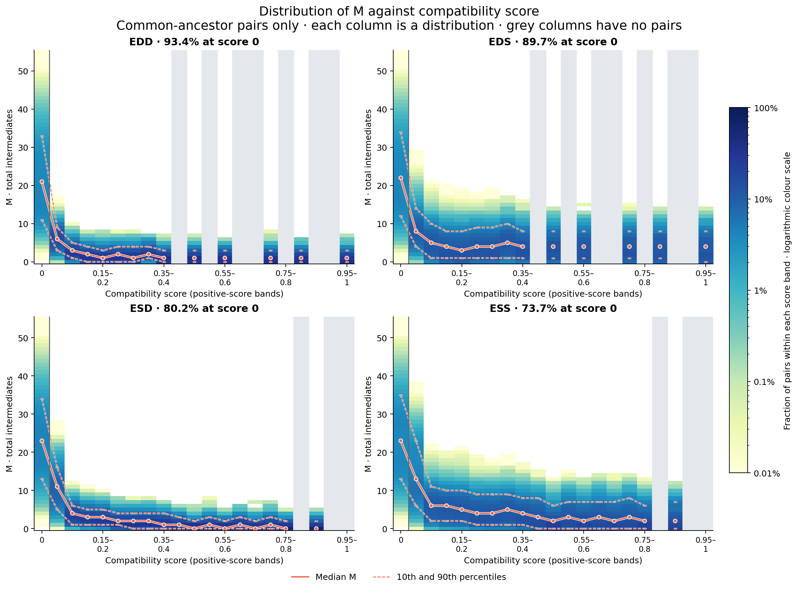

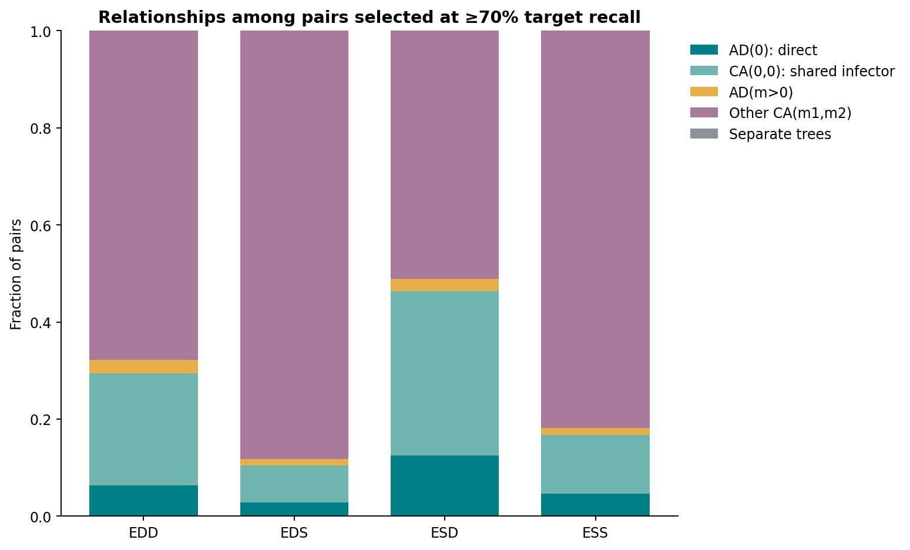

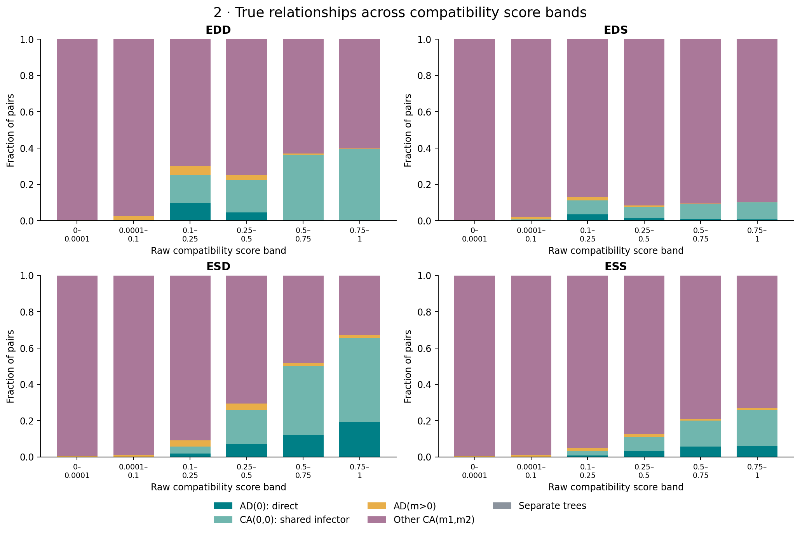

## 3. What the clusters contain

The primary resolution was fixed at 0.3; all configured resolutions are reported. Composition includes every pair sharing a cluster, including missing or discarded graph edges. Both pair-weighted and equal non-singleton-cluster-weighted summaries are saved. The report uses M to describe separation beyond the immediate target. The M curves below pool AD and CA while class-specific counts remain in within_cluster_M.csv. The curve viewport ends at M=15; its denominators include every connected pair, and complete distributions are saved in the tables. Single-case clusters contribute to fragmentation but do not receive an invented pair precision. The true-target graph contains only AD(0) and CA(0,0) edges and uses the same clustering procedure. It is a structural diagnostic, not a certified upper bound. For A → B → C, a single cluster necessarily includes the non-target pair A–C; splitting necessarily loses a target pair. The null comparison uses 20 randomizations preserving cluster sizes, with a second null also preserving each cluster's counts within 7-day sampling bins. The ranges describe random assignments, not confidence intervals across epidemics. BCubed remains a secondary measure against the existing overlapping neighbourhood reference. Leiden follows the established pipeline's CPM objective and selection of restarts by generalized modularity; its RNG is explicitly seeded.

| model | n_clusters | n_singletons | target_pair_precision | direct_edge_retention | median_M_connected | p90_M_connected | bcubed_f1 |
| --- | --- | --- | --- | --- | --- | --- | --- |
| EDD | 1905 | 1081 | 0.4169 | 0.09441 | 1 | 3 | 0.4539 |
| EDS | 2076 | 1391 | 0.1416 | 0.1245 | 3 | 8 | 0.3306 |
| ESD | 1210 | 486 | 0.4258 | 0.4919 | 1 | 2 | 0.6027 |
| ESS | 1214 | 670 | 0.1778 | 0.5219 | 3 | 7 | 0.5347 |
| true_target_graph | 1250 | 333 | 0.9831 | 0.5029 | 0 | 0 | 0.8279 |

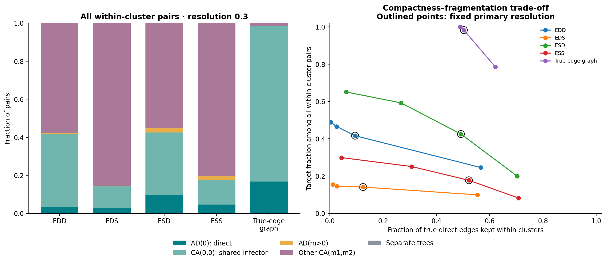

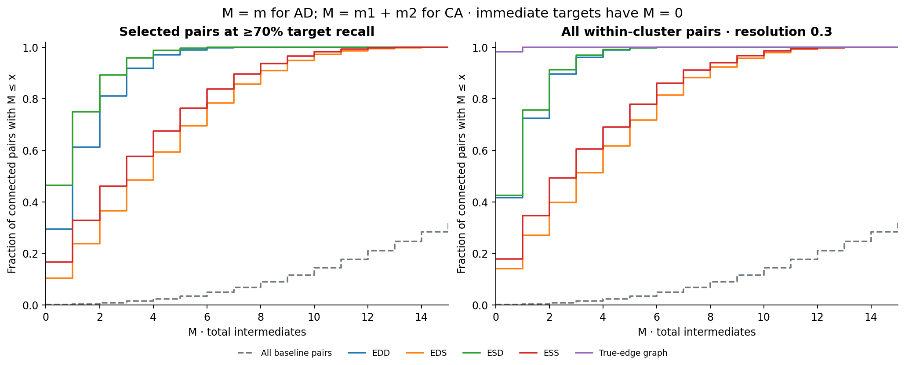

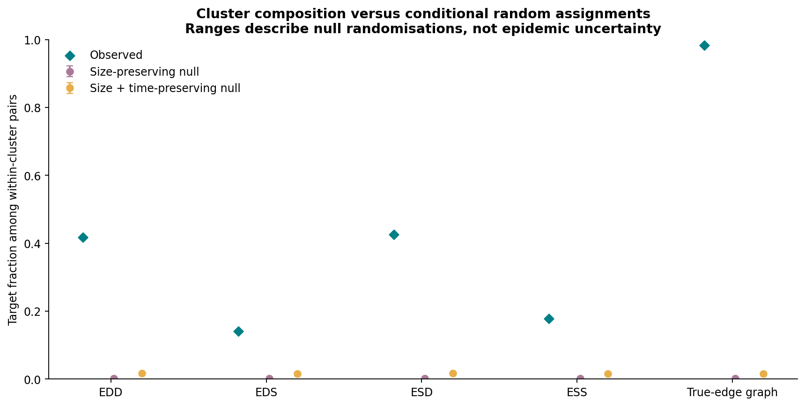

## 4. Assumption checks and separate-observation benchmarks

Cached scorer draws are compared with actual direct and shared-infector pairs. The production scorer receives absolute, rounded time differences, whereas its cached temporal draws are signed. The absolute-time curve is a diagnostic transformation only; none of the EpiLink scores are changed. The epidemic sequence simulator and pairwise scenario simulator also construct genetic branch durations differently. In particular, the epidemic simulator mutates a child sequence from its parent's sampled sequence using the sum of absolute sampling-to-transmission durations; the AD scenario uses a clipped signed sampling-time difference as its branch duration. Joint total-variation summaries round time and genetic draws into unit-width cells; raw marginal Wasserstein distances are also saved. Finite Monte Carlo size, shared cases, discretization, and different simulation constructions all affect these comparisons, so they are diagnostics rather than independent goodness-of-fit tests. The logistic and smoothed feature-cell lookup benchmarks train on a different realization of dates and genomes on this same tree. Their predictions do not use evaluation labels, and the lookup falls back to training prevalence for unseen cells. They are practical comparators, not performance ceilings. The lookup's prior strength is fixed in the exploration configuration. No outcome has been calibrated into a transmission probability here.

| data_process | model | ap | training |
| --- | --- | --- | --- |
| deterministic | genetic_only | 0.4254 | none |
| deterministic | time_only | 0.01009 | none |
| deterministic | joint_logistic | 0.5679 | separate_observation_realization_same_tree |
| deterministic | joint_lookup | 0.5766 | separate_observation_realization_same_tree |
| stochastic | genetic_only | 0.1336 | none |
| stochastic | time_only | 0.01009 | none |
| stochastic | joint_logistic | 0.2756 | separate_observation_realization_same_tree |
| stochastic | joint_lookup | 0.2785 | separate_observation_realization_same_tree |

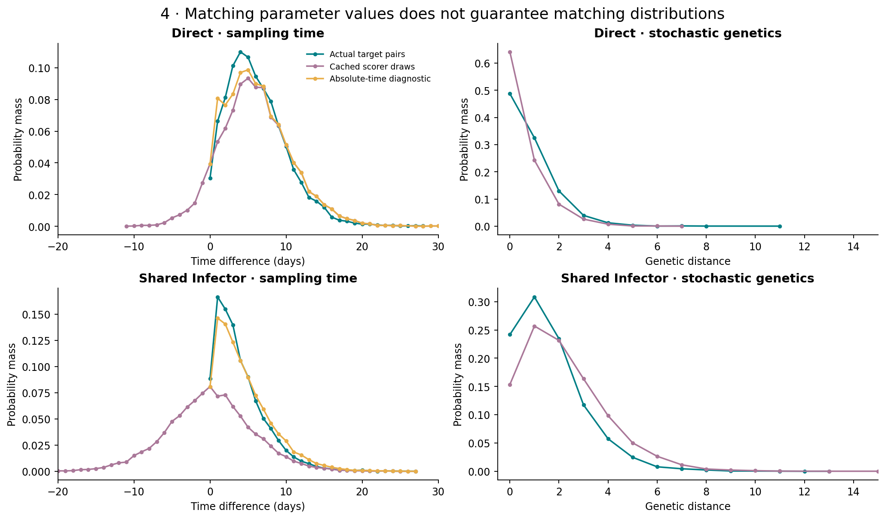

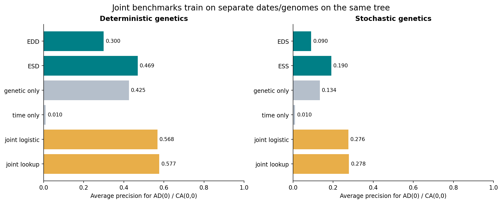

## What remains for confirmation

This baseline establishes descriptive behavior and checks the evaluation machinery. It does not establish generalization across epidemic topologies, separation of independent introductions, or uncertainty across epidemics. Before using these observations to choose final success criteria, freeze the claim and operating rule, then evaluate additional simulation seeds and independently generated trees. Use the existing condition and scenario axes for matched/mismatched parameter experiments, and keep the observed-genetics and inference-genetics axes separate. Do not interpret pair-bootstrap intervals, randomization ranges, or the best resolution in this sweep as independent validation. Sampling experiments must retain hidden intermediates in the full-tree AD/CA encoding. All machine-readable tables and the run manifest remain next to this report.
