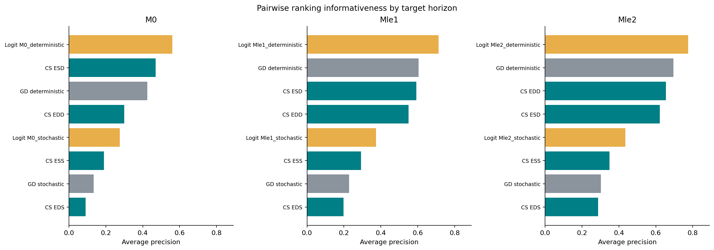
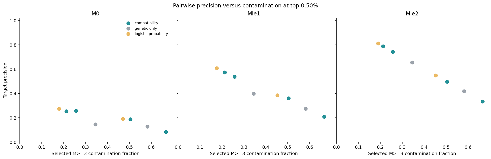
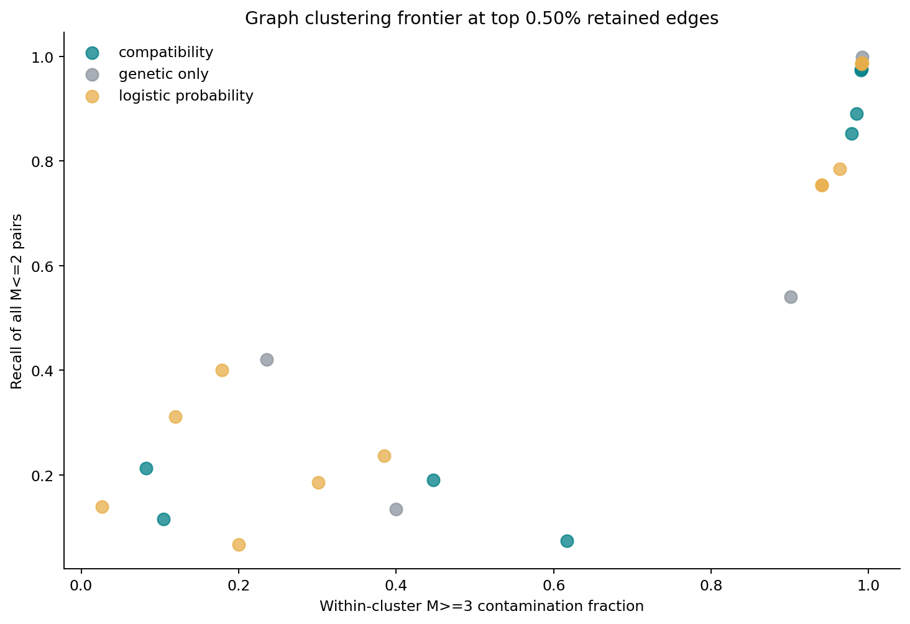
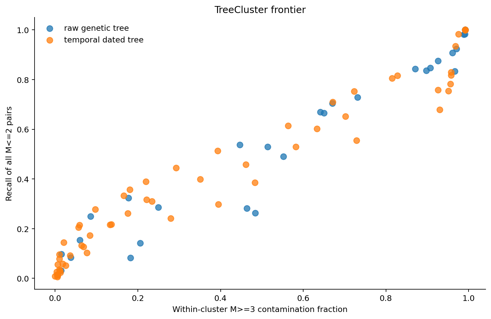

# Synthetic Informativeness

## Run And Scope

This fresh analysis evaluates 12,447,555 unordered pairs among 4,990 sampled cases under the matched baseline seed 12345. M>=3 is treated as negative contamination. The positive endpoints are M==0, M<=1, and M<=2. Compatibility scores remain raw summed EpiLink scores, not probabilities.

## Pairwise Ranking

Compatibility, genetic-only distance, and logistic probabilities are compared separately for each near-transmission endpoint. Logistic probabilities are trained on a separate date/genome realization on the same transmission tree.

| endpoint | score_family | score_name | data_process | ap | target_prevalence |
| --- | --- | --- | --- | --- | --- |
| Mle2 | logistic_probability | logistic_Mle2_deterministic | deterministic | 0.7749 | 0.008468 |
| Mle1 | logistic_probability | logistic_Mle1_deterministic | deterministic | 0.7126 | 0.004144 |
| Mle2 | genetic_only | genetic_only_deterministic | deterministic | 0.6953 | 0.008468 |
| Mle2 | compatibility | compatibility_EDD | deterministic | 0.6555 | 0.008468 |
| Mle1 | genetic_only | genetic_only_deterministic | deterministic | 0.6044 | 0.004144 |
| Mle1 | compatibility | compatibility_ESD | deterministic | 0.593 | 0.004144 |
| M0 | logistic_probability | logistic_M0_deterministic | deterministic | 0.5595 | 0.001447 |
| M0 | compatibility | compatibility_ESD | deterministic | 0.4693 | 0.001447 |
| M0 | genetic_only | genetic_only_deterministic | deterministic | 0.4254 | 0.001447 |

## Operating Points

The table shows the 70% target-recall operating point where available. M>=3 contamination is the selected fraction with at least three total intermediates.

| endpoint | score_name | precision | recall | selected_pairs | Mge3_contamination_fraction | median_M_connected | p90_M_connected |
| --- | --- | --- | --- | --- | --- | --- | --- |
| M0 | logistic_M0_deterministic | 0.4859 | 0.7115 | 26372 | 0.07663 | 1 | 2 |
| M0 | compatibility_ESD | 0.4637 | 0.7019 | 27262 | 0.1076 | 1 | 3 |
| M0 | genetic_only_deterministic | 0.2961 | 0.9428 | 57333 | 0.1682 | 1 | 3 |
| M0 | compatibility_EDD | 0.2939 | 0.7267 | 44533 | 0.1893 | 1 | 3 |
| M0 | logistic_M0_stochastic | 0.1828 | 0.7078 | 69734 | 0.4855 | 2 | 7 |
| M0 | compatibility_ESS | 0.1668 | 0.7064 | 76260 | 0.5394 | 3 | 8 |
| M0 | compatibility_EDS | 0.1044 | 0.711 | 122641 | 0.6342 | 4 | 8 |
| M0 | genetic_only_stochastic | 0.07257 | 0.8283 | 205548 | 0.7041 | 4 | 9 |
| Mle1 | logistic_Mle1_deterministic | 0.6291 | 0.7088 | 58119 | 0.1604 | 1 | 3 |
| Mle1 | compatibility_EDD | 0.5567 | 0.7051 | 65330 | 0.2288 | 1 | 4 |
| Mle1 | compatibility_ESD | 0.501 | 0.7082 | 72905 | 0.2862 | 1 | 4 |
| Mle1 | genetic_only_deterministic | 0.3977 | 0.9439 | 122402 | 0.345 | 2 | 4 |

## Graph Clusters

Connected components and Leiden communities are built from top-score pairwise graphs. Every pair sharing a cluster is evaluated, not only retained graph edges.

| score_name | algorithm | Mle2_pair_recall | Mle2_pair_precision | Mge3_contamination_fraction | n_clusters | n_singletons | bcubed_f1 |
| --- | --- | --- | --- | --- | --- | --- | --- |
| logistic_M0_deterministic | leiden | 0.1395 | 0.9733 | 0.02674 | 1876 | 1073 | 0.6418 |
| compatibility_ESD | leiden | 0.2126 | 0.9173 | 0.08274 | 1236 | 492 | 0.599 |
| compatibility_EDD | leiden | 0.1159 | 0.8953 | 0.1047 | 1936 | 1107 | 0.452 |
| logistic_Mle1_deterministic | leiden | 0.3117 | 0.8808 | 0.1192 | 986 | 387 | 0.6562 |
| logistic_Mle2_deterministic | leiden | 0.4006 | 0.8211 | 0.1789 | 805 | 312 | 0.5995 |
| logistic_M0_stochastic | leiden | 0.06723 | 0.7996 | 0.2004 | 2899 | 2197 | 0.4213 |
| genetic_only_deterministic | leiden | 0.4206 | 0.7648 | 0.2352 | 745 | 304 | 0.5889 |
| logistic_Mle1_stochastic | leiden | 0.1851 | 0.6992 | 0.3008 | 1889 | 1280 | 0.5705 |
| logistic_Mle2_stochastic | leiden | 0.2364 | 0.6151 | 0.3849 | 1582 | 975 | 0.5732 |
| genetic_only_stochastic | leiden | 0.1347 | 0.6003 | 0.3997 | 2557 | 1987 | 0.4898 |
| compatibility_ESS | leiden | 0.1909 | 0.5529 | 0.4471 | 1480 | 841 | 0.5244 |
| compatibility_EDS | leiden | 0.07353 | 0.3833 | 0.6167 | 2200 | 1460 | 0.3125 |

## Oracle Target-Edge Graph

Leiden clustering on the graph containing only true M=0 edges reveals the structural ceiling for any method using this partition-based approach. Perfect pairwise information cannot overcome the non-transitivity of direct/shared-infector relationships.

| score_name | algorithm | Mle2_pair_recall | Mle2_pair_precision | Mge3_contamination_fraction | n_clusters | n_singletons | bcubed_f1 |
| --- | --- | --- | --- | --- | --- | --- | --- |
| oracle_target_edges | leiden | 0.1424 | 1 | 0 | 1250 | 333 | 0.8279 |

## TreeCluster

TreeCluster status: complete. Raw genetic FastME trees and temporal dated TreeTime trees are evaluated when TreeCluster.py is available.

| tree_kind | data_process | method | threshold | threshold_days | Mle2_pair_recall | Mle2_pair_precision | Mge3_contamination_fraction | bcubed_f1 |
| --- | --- | --- | --- | --- | --- | --- | --- | --- |
| temporal_dated_tree | deterministic | max_clade | 0.01918 | 7 | 0.008272 | 1 | 0 | 0.2764 |
| temporal_dated_tree | deterministic | max_clade | 0.03836 | 14 | 0.02561 | 0.9967 | 0.003322 | 0.4193 |
| temporal_dated_tree | deterministic | avg_clade | 0.01918 | 7 | 0.01472 | 0.9955 | 0.00449 | 0.3184 |
| temporal_dated_tree | stochastic | max_clade | 0.01918 | 7 | 0.005758 | 0.9951 | 0.004918 | 0.2414 |
| temporal_dated_tree | deterministic | max_clade | 0.05753 | 21 | 0.05596 | 0.9941 | 0.005898 | 0.5473 |
| temporal_dated_tree | stochastic | avg_clade | 0.01918 | 7 | 0.01076 | 0.9939 | 0.006135 | 0.2714 |
| temporal_dated_tree | stochastic | max_clade | 0.03836 | 14 | 0.01595 | 0.9935 | 0.006501 | 0.3253 |
| temporal_dated_tree | deterministic | avg_clade | 0.03836 | 14 | 0.07884 | 0.99 | 0.01001 | 0.5929 |
| temporal_dated_tree | stochastic | max_clade | 0.05753 | 21 | 0.03504 | 0.9898 | 0.01018 | 0.4271 |
| temporal_dated_tree | deterministic | max_clade | 0.07671 | 28 | 0.09625 | 0.9898 | 0.01024 | 0.632 |
| temporal_dated_tree | deterministic | single_linkage | 0.01918 | 7 | 0.0309 | 0.9882 | 0.01183 | 0.3893 |
| temporal_dated_tree | stochastic | single_linkage | 0.01918 | 7 | 0.02375 | 0.9874 | 0.01262 | 0.3365 |

## Interpretation

A score is informative for this purpose when it recovers M==0, M<=1, or M<=2 pairs with less M>=3 contamination than genetic distance alone. Cluster outputs should be read as compactness-versus-recall trade-offs, with BCubed retained as a secondary reference metric.
