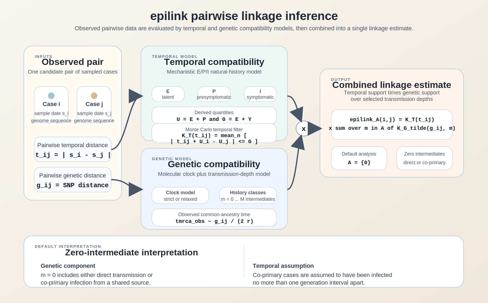

# epilink main-text methods subsection

*Suggested figure legend.* Overview of `epilink` pairwise linkage inference. Observed temporal distance ($t_{ij}$) and genetic distance ($g_{ij}$) for a candidate case pair are evaluated against a mechanistic temporal model and a molecular clock-based genetic model. The temporal component estimates the compatibility of the observed time gap with sampled incubation periods and generation intervals, while the genetic component estimates compatibility with transmission histories containing different numbers of intermediate hosts. These components are combined into the final linkage estimate. In the default zero-intermediate analysis ($A=\{0\}$), the genetic component includes both direct transmission and co-primary infection from a shared source, while the temporal component assumes co-primary infections occur no more than one generation interval apart.

## Pairwise linkage inference with epilink

We developed `epilink`, a pairwise transmission-linkage model that combines temporal information and viral genetic distance to quantify whether two observed cases are compatible with recent transmission. For each pair of cases $(i,j)$, the inputs are an observed temporal distance $t_{ij}$ (days between case observations) and an observed genetic distance $g_{ij}$ (consensus-level nucleotide differences). `epilink` returns the linkage estimate

$$
\hat{P}_A(i,j \mid g_{ij}, t_{ij}) = K_T(t_{ij}) \sum_{m \in A} \tilde{K}_G(g_{ij}, m),
$$

where $K_T(t_{ij})$ is the temporal compatibility of the pair, $\tilde{K}_G(g_{ij},m)$ is the normalized genetic compatibility under a transmission history with $m$ intermediate hosts, and $A$ is the set of intermediary counts included in the target linkage definition. Unless otherwise stated, we used the default setting $A=\{0\}$, corresponding to a zero-intermediate definition of recent transmission. In the genetic component, this class includes both direct transmission between the sampled cases and co-primary infection from a shared source; in the temporal component, co-primary cases are assumed to have been infected no more than one generation interval apart.

The temporal component is based on a mechanistic $E/P/I$ infectiousness model for SARS-CoV-2, following Hart et al. (2021). Infection is followed by a latent stage ($E$), a presymptomatic infectious stage ($P$), and a symptomatic infectious stage ($I$), with Gamma-distributed stage durations. The incubation period is therefore $U = E + P$, and the generation interval is obtained by combining the latent period with a sampled infectiousness-to-transmission time.

Temporal compatibility is estimated by Monte Carlo simulation. For each draw $n = 1, \ldots, N$, `epilink` samples incubation periods $U_i^{(n)}$ and $U_j^{(n)}$ and a generation interval $G^{(n)}$, and computes

$$
K_T(t_{ij}) =
\frac{1}{N}
\sum_{n=1}^{N}
\mathbf{1}
\left(
\left| t_{ij} + U_i^{(n)} - U_j^{(n)} \right|
\le G^{(n)}
\right),
$$

where $\mathbf{1}(\cdot)$ is the indicator function. Thus, $K_T(t_{ij})$ is the proportion of simulated draws for which the observed temporal gap is compatible with the sampled natural-history realization.

The genetic component uses a molecular clock with median substitution rate $\bar{r}$ per site per year and genome length $L$. Under a strict clock the substitution rate is fixed, whereas under a relaxed clock branch-specific rates are sampled from a log-normal distribution. For a given genetic distance $g_{ij}$, each draw implies an observed time to most recent common ancestor, approximately $g_{ij}/(2r^{(n)})$. `epilink` compares this with simulated times to common ancestry under transmission-chain and common-source histories for each allowed number of intermediate hosts $m$. The resulting raw compatibility weights are normalized across transmission depths,

$$
\tilde{K}_G(g_{ij}, m) =
\frac{K_G(g_{ij}, m)}{\sum_{m'=0}^{M} K_G(g_{ij}, m')},
$$

and the final linkage estimate is obtained by summing the normalized weights over the selected set $A$.

All quantities are therefore estimated within a common Monte Carlo framework that samples incubation periods, generation intervals, transmission offsets, and molecular clock rates. `epilink` is intended to provide a mechanistically informed pairwise linkage measure rather than a full reconstruction of the transmission tree. A full formal specification of the model and simulation procedure is provided in the Appendix.
